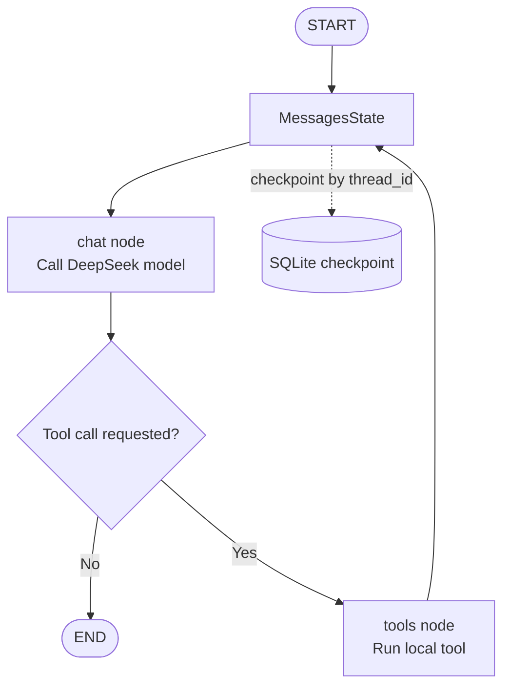

# LangGraph Demo

This directory contains a LangGraph workflow that calls DeepSeek through its
OpenAI-compatible API and can use a repository skill plus local tools.

## How the framework works

LangGraph models an application as a graph of stateful nodes. Nodes perform work,
while edges define the execution order:

```text
START -> chat node -> (tools node -> chat node)* -> END
```

This demo follows that flow:

1. `MessagesState` defines the graph state as a list of chat messages.
2. `build_graph` creates a `ChatOpenAI` client configured for DeepSeek.
3. All Markdown files under `skills/` are loaded as a system message on the first
   turn of a conversation.
4. `SqliteSaver` stores graph checkpoints in a local SQLite database.
5. The `chat` node sends the current messages to the model.
6. If the model requests a tool, `ToolNode` executes it and routes the result back
   to `chat`; otherwise the graph ends.
7. `graph.invoke` uses `thread_id` to resume the selected conversation.

The graph structure is explicit, so additional nodes and branches can be added
without changing the model-call interface.

## Basic concepts

LangGraph is used to build stateful, looping, tool-using AI workflows.

- **State** is the shared data carried through the workflow. This demo uses
  `MessagesState`, which stores the conversation messages.
- **Node** is a function that performs work. The `chat` node calls the model and
  the `tools` node executes requested local tools.
- **Edge** connects nodes and defines the normal execution order.
- **Conditional edge** chooses the next node from the current state. Here,
  `tools_condition` checks whether the model requested a tool call.
- **Checkpoint** persists state so a workflow can be resumed later. This demo
  uses `SqliteSaver` and a `thread_id` session identifier.
- **ToolNode** runs model-requested tools and adds their results back to the
  message state.

Compared with a single LangChain model call, LangGraph is useful for multi-step
agents, tool-call loops, conditional branches, long-running tasks, resumable
conversations, and human-in-the-loop workflows.

## Core work loop

The central loop in this demo is:



The model can answer directly and finish, or request `search_factorio_files`.
After the tool runs, its result is added to the message state and sent back to
the model. The loop continues until the model returns a final answer without a
tool call. The checkpoint lets a later invocation with the same `thread_id`
continue the conversation.

## Current capabilities

This example supports:

- Multi-turn conversations across separate command invocations.
- Conversation recovery through SQLite checkpoints and `--session-id`.
- Repository skills loaded from `skills/*.md`, including `factorio.md`,
  `factorio-api.md`, and `google-or-tools.md`.
- Tool calling with the `search_factorio_files` local tool.
- One model node with explicit `START` and `END` edges.
- DeepSeek's OpenAI-compatible API through `ChatOpenAI`.
- Model selection with `--model` or `LANGGRAPH_MODEL`.
- Deterministic generation with `temperature=0`.
- Interactive input/output mode when no question argument is provided.

It intentionally does not yet include remote MCP servers, human approval, streaming,
retries, or a remote checkpoint store.

## LangGraph capabilities

LangGraph is useful for workflows that require:

- Multiple specialized agent or processing nodes.
- Conditional routing and branches.
- Loops for planning, tool use, and iterative refinement.
- Shared state across steps.
- Durable checkpoints and resumable execution.
- Human-in-the-loop approval.
- Streaming intermediate state and custom events.
- Fault handling, retries, and observability.

LangChain supplies model, prompt, tool, and message integrations; LangGraph adds
explicit workflow orchestration and state management around those components.

## Adding skills and MCP tools

A skill is an instruction file loaded into the system message. Add a Markdown file
under `skills/`; the demo loads all such files before the first user message in a
conversation. Keep skills focused on domain rules, project conventions, and safety
constraints.

Local tools are Python functions decorated with `@tool`. Add them to the `tools`
list, pass that list to `model.bind_tools(tools)`, and register it with
`ToolNode(tools)`. The conditional edge sends tool calls through the tool node and
loops the result back to the model.

For MCP, create an MCP client session during graph setup, call `list_tools()`, and
adapt each MCP tool to the LangChain tool interface. Register those adapters in the
same `tools` list. Keep the MCP session open for the lifetime of the graph and
close it when the process exits. Never expose an MCP server to the model without
reviewing its tool permissions and input validation.

## Run

Configure a DeepSeek API key and use the workspace virtual environment:

```zsh
export DEEPSEEK_API_KEY="your-deepseek-api-key"
/Users/zhangqishang/factorio-scripts/.venv/bin/python \
  demo-langgraph/langgraph-demo.py --session-id factory-help
```

The command starts an interactive input/output loop. Enter a question after the
`You:` prompt; type `exit` or `quit` to leave. The same `--session-id` resumes
the conversation across separate launches:

```zsh
/Users/zhangqishang/factorio-scripts/.venv/bin/python \
  demo-langgraph/langgraph-demo.py \
  --session-id factory-help \
  "How does it differ from a normal variable?"
```

To make a single request without entering interactive mode, pass the question
as the positional argument:

```zsh
/Users/zhangqishang/factorio-scripts/.venv/bin/python \
  demo-langgraph/langgraph-demo.py \
  --session-id factory-help \
  "What is a graph state?"
```

Checkpoints are stored in `demo-langgraph/checkpoints.db` by default. Use
`LANGGRAPH_CHECKPOINT_DB` or `--db` to choose another SQLite file. Use a new
session ID to start a separate conversation. If a process is interrupted while
a tool call is being written, the next run detects the incomplete tool history,
clears that thread's messages, and starts again with the current question.

The default model is `deepseek-v4-flash`. Override it with either option:

```zsh
LANGGRAPH_MODEL="deepseek-v4-flash" \
/Users/zhangqishang/factorio-scripts/.venv/bin/python \
  demo-langgraph/langgraph-demo.py
```

```zsh
/Users/zhangqishang/factorio-scripts/.venv/bin/python \
  demo-langgraph/langgraph-demo.py \
  --model deepseek-v4-flash \
  "Summarize state graphs."
```

Do not commit API keys to the repository.
